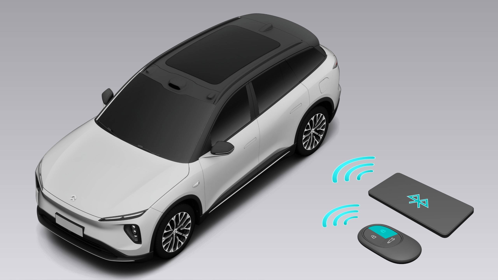
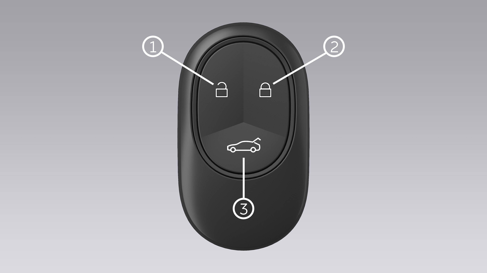

## ES6用户手册

### ES6 免责声明

感谢您选择蔚来品牌的 ES6 车型（以下简称“ES6”）。 ES6 是一款智能电动汽车，在您使用 ES6 的绿色旅程中，您将获得贴心周到的用户体验。

开启ES6 的旅程之前建议您阅读车辆中控屏上的《用户手册》，了解车辆使用所需的全部信息。

- 未经合法有效授权，任何人不得对本手册内容进行全部或部分复制或修改。
- 未经合法有效授权，任何人不得私自改装、调整、拆卸车辆部件，以免造成车辆功能失效或人身伤害。
- 本手册使用的标签、标志、图片仅用于说明示意，内容仅供参考。

您车辆的实际装备、配置、功能等可能与本手册的描述和图示有所不同，但会随车辆软件版本的更迭而进行升级，请您以车辆的实际装备、配置、功能等为准。为免疑义，蔚来汽车有权出于安全、遵守法律法规和其他的考量，决定是否开放以及何时开放车辆的装备、配置、功能等以及相关的软件升级。

请严格遵守本手册中使用的警示信息内容，该信息将有助于您更安全地使用车辆。同时，也请您随时关注蔚来汽车向您发布的任何其他警示信息。请务必确保您在使用 ES6 前，已仔细阅读本手册的最新版本并熟悉 ES6 的各项功能。**如果没有正确操作ES6，可能会对您或他人的人身造成伤害，或者导致车辆损坏或财产损失，蔚来汽车对此不承担任何责任。**

- 警告 ： 此内容与人身安全密切相关，如不遵守可能导致人身伤害或严重事故，请务必遵守！
- 注意 ： 此内容提示您如何避免可能发生的车辆损坏或财产损失。
- 说明 ： 此内容为您更好地使用车辆提供建议。

若您对本手册有任何疑问，请致电蔚来热线: 400-999-6699，或登录蔚来汽车官网获取最新版《ES6 用户手册》。

若遇紧急情况需要救援，请致电蔚来热线: 400-999-6699。

### 目录
- [锁]
  - [寻车](#寻车)
  - [智能钥匙解锁上锁](#智能钥匙解锁上锁)
  - [智能钥匙更换电池](#智能钥匙更换电池)
  - [无钥匙解锁上锁](#无钥匙解锁上锁)
  - [手机 App 解锁和上锁](#手机 App 解锁和上锁)
  - [手机蓝牙钥匙](#手机蓝牙钥匙)
  - [NFC 解锁上锁](#NFC 解锁上锁)
  - [中控解锁上锁](#中控解锁上锁)
  - [应急解锁上锁](#应急解锁上锁)
  - [近车自动解锁](#近车自动解锁)
  - [驻车自动解锁](#驻车自动解锁)
  - [离车自动上锁](#离车自动上锁)
  - [行驶后自动上锁](#行驶后自动上锁)
  - [防盗警报系统](#防盗警报系统)

### 寻车
#### 距车辆较远时寻车
您或授权用户均可以使用手机 App 查询车辆停放的地理位置信息。车辆连接至网络时，您可在手机 App 上“爱车”页面上方查看到当前车辆停泊的地理位置，点击此位置信息，可在地图界面查看到车辆的当前位置。

您可在中控屏下方控制栏进入设置页面，点击**行车驻车>寻车照片**开启或关闭该功能。

功能开启后，当您停好车辆并离开后，车辆会自动收集并处理停车环境和车辆底部的图片并上传至蔚来 App，您可在手机 App 上“爱车”页面，点击车辆位置即可查看车辆停放区域信息。

**说明**

寻车照片功能采集的图片均会进行脱敏及加密处理，保护用户隐私。

#### 距车辆较近时寻车
车辆处于非驾驶状态且有效钥匙距离车辆 70 米以内时（随智能钥匙状态和车辆周边环境而不同），3 秒内连续按下两次智能钥匙上的上锁按钮，车辆喇叭鸣响，转向灯闪烁，提示您车辆的精确位置。再次按下此按钮将解除寻车提示，否则此寻车功能将在 10 秒钟后自动关闭。

接通手机蓝牙钥匙功能或车辆连接网络时，您也可在手机 App 上“爱车”页面使用“寻车”按键进行寻车，此时车辆喇叭鸣响，转向灯闪烁。随后再次按下寻车按键将解除寻车提示。

### 智能钥匙解锁上锁
进入车辆之前，您可以使用智能钥匙解锁车辆。随智能钥匙状态和车辆周边环境而不同，智能钥匙的最远有效范围为车外 30-70 米。

智能钥匙的按钮及功能如下：

1. 车辆解锁按钮
   - 车辆为 P 挡时，短按此按钮可解锁车辆，解锁后车辆两侧转向灯将闪烁三次提示解锁成功，解锁成功后车外门把手自动弹出。
   - 通过智能钥匙解锁四个车门后，无需钥匙即可从外部打开尾门。
   - 长按解锁按钮可同时打开全部车窗；车窗运动过程中放开解锁按钮则车窗停留在当前位置。
   - 您可以通过中控屏设置智能钥匙的解锁方式：在中控屏下方控制栏进入设置页面，点击 **门窗锁>车门>车辆解锁模式 。**
      - 选择 **全车：** 只需按一次钥匙解锁按钮则可同时解锁全车车门；
      - 选择 **主驾车门：** 第一次按下钥匙解锁按钮仅解锁驾驶员侧车门，再次按下解锁按钮可解锁其余三个车门。

2. 车辆上锁按钮
   - 车辆挂 P 挡，关闭所有车门（包括前盖及尾门）后，短按此按钮可实现全车上锁，全车上锁后两侧转向灯将闪烁一次并且喇叭鸣响一次以提示上锁成功，同时车外门把手收回，外后视镜自动折叠（在中控屏下方控制栏进入设置页面，点击 **位置调节>外后视镜>锁车自动折叠，** 设置外后视镜自动折叠）。
   - 上锁后尾门仅可通过智能钥匙从外部打开。
   - 您可以通过中控屏设置喇叭提示音的打开/关闭，在中控屏下方控制栏进入设置页面，点击 **声音>车辆提示音>锁车提示音。**
   - 长按上锁按钮可同时关闭全部车窗；车窗运动过程中放开上锁按钮则车窗停留在当前位置。
   - 车辆处于非驾驶状态且有效智能钥匙距离车辆 70 米以内时，您可以在 3 秒钟内连续按下两次启动寻车功能，转向灯及喇叭均会发出提示。再次按下此按钮将解除寻车提示，否则寻车功能将在 10 秒钟后自动关闭。
   - 当全部车门关闭时，您可在车外按下智能钥匙上锁按钮，此时车辆已上锁，转向灯将闪烁一次并且喇叭鸣叫一次以提示上锁成功。若有车门未关，此时按下上锁按钮则车辆无法上锁，您将收到手机 App 提醒信息，提示您车辆未成功上锁。

3. 尾门打开按钮
   尾门关闭状态时，长按此按钮可打开尾门；尾门打开状态时，再次长按此按钮可关闭尾门。

**警告**

在您离开车辆时如果有人或宠物留在车内，请务必携带智能钥匙，钥匙留在车内可能造成车内人员意外伤害。

**注意**

- 智能钥匙为电子零件，请避免撞击、拆卸或放置于高温、潮湿及强烈震动的场所。
- 若您在上锁时车内仍有乘客，此时可进行智能钥匙上锁操作，乘客仍能从里面打开车门，但会触发防盗警报系统。
- 若上锁后车内仍有智能钥匙或手机蓝牙钥匙，车辆仍可进行智能钥匙上锁操作，手机 App 将提示您车内有钥匙。
- 若乘客将智能钥匙或开启蓝牙钥匙功能的手机带出车外 3 米以上，车辆将提示您钥匙离开车辆。
- 如果车辆在解锁后 30 秒内未打开任何车门或尾门且乘客将智能钥匙或开启蓝牙钥匙功能的手机带出车外 3 米以上，所有车门及尾门都自动重新上锁。
- 若钥匙遗失或损坏，请立即联系蔚来汽车服务中心，携带当前所有钥匙进行钥匙的绑定操作，申领新的钥匙。

**注意**

智能钥匙亏电时可使用物理应急钥匙上锁驾驶侧车门，所有车门随之一同上锁。

车辆为驻车状态时为方便锁车操作，您可以在中控屏下方控制栏进入设置页面，点击 **门窗锁>车窗>锁车自动关窗，** 当您使用车外上锁方式（如智能钥匙、NFC、手机 App、无钥匙上锁、离车自动上锁）对车辆进行上锁时，可自动关闭车辆所有车窗，关闭过程中带有防夹功能。车窗关闭过程中若按下智能钥匙或手机 App 解锁上锁按钮，则车窗关闭动作停止。

**注意**

- 执行锁车自动关窗时请确保车辆已成功上锁。
- 若车内前排位置有人时，锁车时仅车辆上锁，车辆车窗不执行关闭动作，守护车内人员安全。请关注后排是否有乘客及宠物。
- 若在车窗上升过程中执行锁车操作，车窗将终止上升行程，此时可先执行一次解锁操作，随后重新对车辆进行上锁，即可实现锁车自动关窗。

### 智能钥匙更换电池

